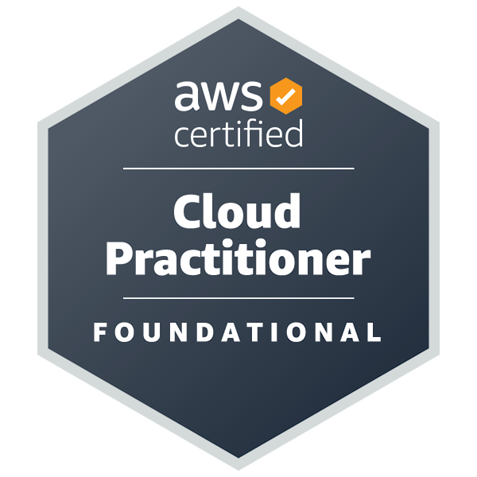
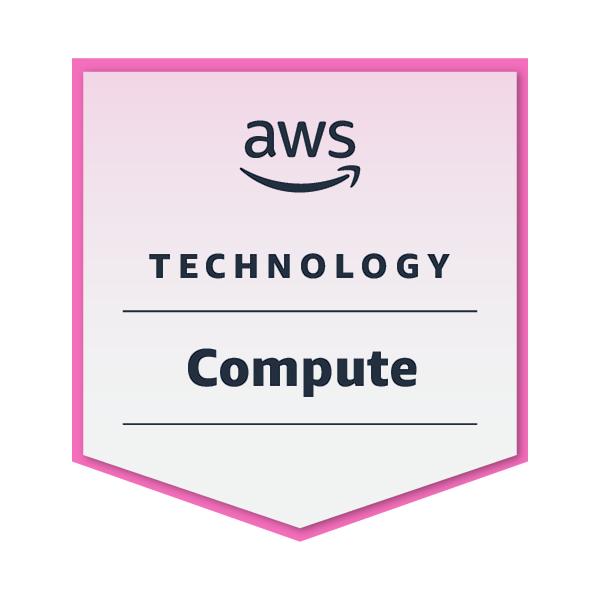

# 🚀 Who am I

---

## 📌 Contact Me

---

## 🛠️ Daily Tools

|                                                                                                                                                         OS & Platforms                                                                                                                                                         |                                                                                                                                                                                                                                                                                      Cloud & DevOps                                                                                                                                                                                                                                                                                      |                                                                                                                                                                                                             VCS & Shell                                                                                                                                                                                                              |                                                                                                                                                                                                                                                                                                                                                                                           Languages                                                                                                                                                                                                                                                                                                                                                                                            |                                                                                                                                                                                                                       Databases                                                                                                                                                                                                                       |                                                                                                                                                                                                                                                                                                                                       Frameworks                                                                                                                                                                                                                                                                                                                                       |
| :----------------------------------------------------------------------------------------------------------------------------------------------------------------------------------------------------------------------------------------------------------------------------------------------------------------------------: | :--------------------------------------------------------------------------------------------------------------------------------------------------------------------------------------------------------------------------------------------------------------------------------------------------------------------------------------------------------------------------------------------------------------------------------------------------------------------------------------------------------------------------------------------------------------------------------------: | :----------------------------------------------------------------------------------------------------------------------------------------------------------------------------------------------------------------------------------------------------------------------------------------------------------------------------------------------------------------------------------------------------------------------------------: | :--------------------------------------------------------------------------------------------------------------------------------------------------------------------------------------------------------------------------------------------------------------------------------------------------------------------------------------------------------------------------------------------------------------------------------------------------------------------------------------------------------------------------------------------------------------------------------------------------------------------------------------------------------------------------------------------------------------------------------------------------------------------------------------------: | :---------------------------------------------------------------------------------------------------------------------------------------------------------------------------------------------------------------------------------------------------------------------------------------------------------------------------------------------------------------------------------------------------------------------------------------------------: | :------------------------------------------------------------------------------------------------------------------------------------------------------------------------------------------------------------------------------------------------------------------------------------------------------------------------------------------------------------------------------------------------------------------------------------------------------------------------------------------------------------------------------------------------------------------------------------------------------------------------------------------------------------------------------------: |
|        |              |           |                    |           |                 |

---

## 🎓 Certificados

|  |  |
| :------------------------------------------------------: | :-------------------------------------------: |
|                  AWS Cloud Practitioner                  |             AWS Knowledge Compute             |

---

## 🖥️ Languages

---

> "Os filósofos limitaram-se a interpretar o mundo de diversas maneiras, o que importa é transformá-lo."
